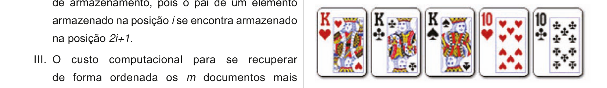

# Questão 26

Um baralho tem 52 cartas, organizadas em 4 naipes, com 13 valores diferentes para cada naipe. Os valores possíveis são: Ás, 2, 3, ..., 10, J, Q, K. No jogo de poker, uma das combinações de 5 cartas mais valiosas é o full house, que é formado por três cartas de mesmo valor e outras duas cartas de mesmo valor. São exemplos de full houses: i) três cartas K e duas 10 (como visto na figura) ou ii) três cartas 4 e duas Ás. Quantas possibilidades para full house existem em um baralho de 52 cartas?

## Alternativas

A. 156.
B. 624.
C. 1872.
D. 3744.
E. 7488.
