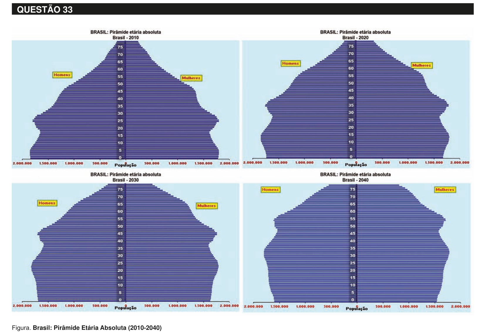

# Questão 33

Disponível em: <www.ibge.gov.br/home/estatistica/populacao/projecao_da_populacao/piramide/piramide.shtm>. Acesso em: 23 ago. 2011. Com base na projeção da população brasileira para o período 2010-2040 apresentada nos gráficos, avalie as seguintes asserções. Constata-se a necessidade de construção, em larga escala, em nível nacional, de escolas especializadas na Educação de Jovens e Adultos, ao longo dos próximos 30 anos. PORQUE Haverá, nos próximos 30 anos, aumento populacional na faixa etária de 20 a 60 anos e decréscimo da população com idade entre 0 e 20 anos. A respeito dessas asserções, assinale a opção correta.

## Alternativas

A. As duas asserções são proposições verdadeiras, e a segunda é uma justificativa correta da primeira.
B. As duas asserções são proposições verdadeiras, mas a segunda não é uma justificativa da primeira.
C. A primeira asserção é uma proposição verdadeira, e a segunda, uma proposição falsa.
D. A primeira asserção é uma proposição falsa, e a segunda, uma proposição verdadeira.
E. Tanto a primeira quanto a segunda asserções são proposições falsas.
