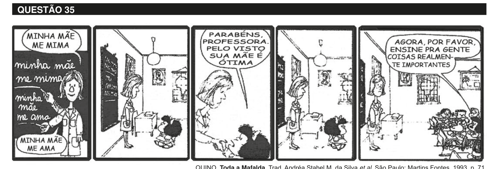

# Questão 35

Muitas vezes, os próprios educadores, por incrível que pareça, também vítimas de uma formação alienante, não sabem o porquê daquilo que dão, não sabem o significado daquilo que ensinam e quando interrogados dão respostas evasivas: “é pré-requisito para as séries seguintes”, “cai no vestibular”, “hoje você não entende, mas daqui a dez anos vai entender”. Muitos alunos acabam acreditando que aquilo que se aprende na escola não é para entender mesmo, que só entenderão quando forem adultos, ou seja, acabam se conformando com o ensino desprovido de sentido. VASCONCELLOS, C. S. Construção do conhecimento em sala de aula. 13ª ed. São Paulo: Libertad, 2002, p. 27-8. Correlacionando a tirinha de Mafalda e o texto de Vasconcellos, avalie as afirmações a seguir. I. O processo de conhecimento deve ser refletido e encaminhado a partir da perspectiva de uma prática social. II. Saber qual conhecimento deve ser ensinado nas escolas continua sendo uma questão nuclear para o processo pedagógico. III. O processo de conhecimento deve possibilitar compreender, usufruir e transformar a realidade. IV. A escola deve ensinar os conteúdos previstos na matriz curricular, mesmo que sejam desprovidos de significado e sentido para professores e alunos. V. Os projetos curriculares devem desconsiderar a influência do currículo oculto que ocorre na escola com caráter informal e sem planejamento. É correto apenas o que se afirma em

## Alternativas

A. I e III.
B. I e IV.
C. II e IV.
D. I, II e III.
E. II, III e IV.
