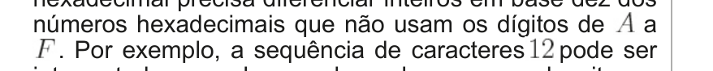
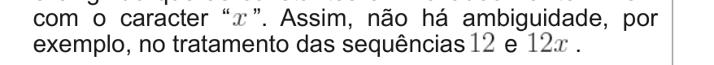
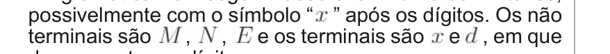
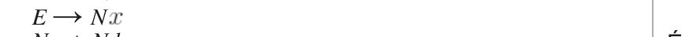
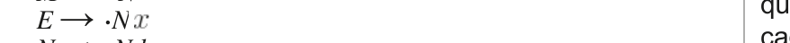
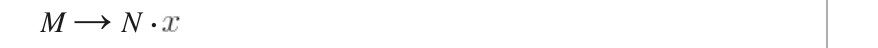
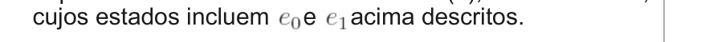

# Questão 38

É comum que linguagens de programação permitam a descrição textual de constantes em hexadecimal, além de descrições na base dez. O compilador para uma linguagem que suporte constantes inteiras em hexadecimal precisa diferenciar inteiros em base dez dos

hexadecimal. Uma maneira de resolver esse problema é exigindo que as constantes em hexadecimal terminem com o caracter “ ”. Assim, não há ambiguidade,g por g

A gramática a seguir descreve números inteiros, possivelmente com o símbolo “ ” após os dígitos. Os não

M → E M → N E → N N

N → d Durante a construção de um autômato LR para essa gramática, os seguintes estados são definidos: e0: M´ → ·M M → ·E M → ·N E → ·N N

N → ·d e1(e0, N): M → N · M → N ·

A respeito dessa gramática, analise as seguintes asserções e a relação proposta entre elas. A gramática descrita é do tipo LR(0). PORQUE É possível construir um autômato LR(0), determinístico, cujos estados incluem e acima descritos.

Acerca dessas asserções, assinale a opção correta.

## Alternativas

A. As duas asserções são proposições verdadeiras, e a segunda é uma justificativa correta da primeira.
B. As duas asserções são proposições verdadeiras, mas a segunda não é uma justificativa correta da primeira.
C. A primeira asserção é uma proposição verdadeira, e a segunda, uma proposição falsa.
D. A primeira asserção é uma proposição falsa, e a segunda, uma proposição verdadeira.
E. Tanto a primeira quanto a segunda asserções são proposições falsas.
