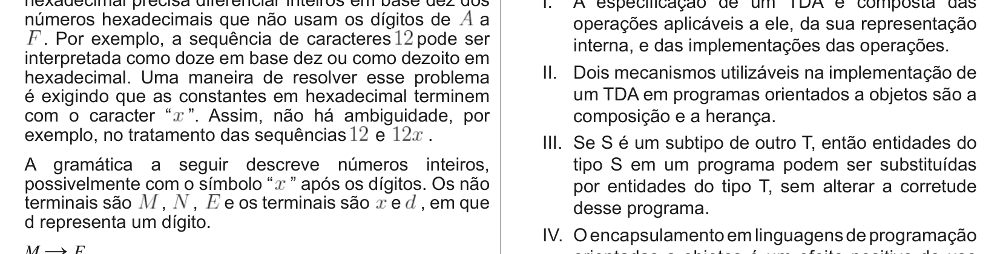

# Questão 39

O conceito de Tipo de Dados Abstrato (TDA) é popular em linguagens de programação. Nesse contexto, analise as afirmativas a seguir. I. A especificação de um TDA é composta das

operações aplicáveis a ele, da sua representação interna, e das implementações das operações. II. Dois mecanismos utilizáveis na implementação de um TDA em programas orientados a objetos são a composição e a herança. III. Se S é um subtipo de outro T, então entidades do tipo S em um programa podem ser substituídas por entidades do tipo T, sem alterar a corretude desse programa. IV. O encapsulamento em linguagens de programação orientadas a objetos é um efeito positivo do uso de TDA. É correto apenas o que se afirma em

## Alternativas

A. I.
B. II.
C. I e III.
D. II e IV.
E. III e IV.
