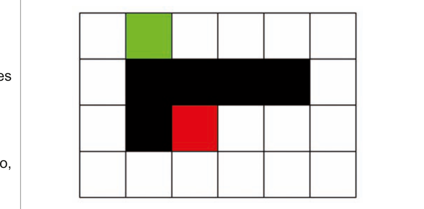

# Questão 40

Considere que a figura abaixo corresponde ao cenário de um jogo de computador. Esse cenário é dividido em 24 quadrados e a movimentação de um personagem entre cada quadrado tem custo 1, sendo permitida apenas na horizontal ou na vertical. Os quadrados marcados em preto correspondem a regiões para as quais os personagens não podem se mover.

Nesse cenário, o algoritmoA* vai ser usado para determinar o caminho de custo mínimo pelo qual um personagem deve se mover desde o quadrado verde até o quadrado vermelho. Considere que, no A*, o custo f(x) = g(x) + h(x) de determinado nó x é computado somando-se o custo real g(x) ao custo da função heurística h(x) e que a função heurística utilizada é a distância de Manhattan (soma das distâncias horizontal e vertical de x até o objetivo). Desse modo, o custo f(x) do quadrado verde é igual a

## Alternativas

A. 2.
B. 3.
C. 5.
D. 7.
E. 9.
