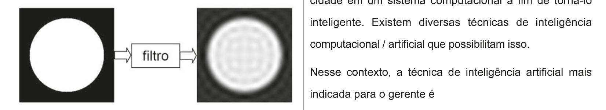

# Questão 41

A figura abaixo ilustra a tentativa de se utilizar um filtro digital no domínio da frequência, para suavizar o sinal bidimensional de entrada que está no domínio do espaço.

A partir do resultado obtido no processo de filtragem, analise as seguintes asserções e a relação proposta entre elas. O sinal de saída possui as características de um sinal processado por um filtro passa-baixa ideal. PORQUE Embora suavizado, o sinal de saída evidencia a presença do efeito de ringing, que é típico de um sinal convolucionado pela função sinc no domínio do espaço. Acerca dessas asserções, assinale a opção correta.

## Alternativas

A. As duas asserções são proposições verdadeiras, e a segunda é uma justificativa correta da primeira.
B. As duas asserções são proposições verdadeiras, mas a segunda não é uma justificativa correta da primeira.
C. A primeira asserção é uma proposição verdadeira e a segunda, uma proposição falsa.
D. A primeira asserção é uma proposição falsa e a segunda, uma proposição verdadeira.
E. Tanto a primeira quanto a segunda asserções são proposições falsas.
