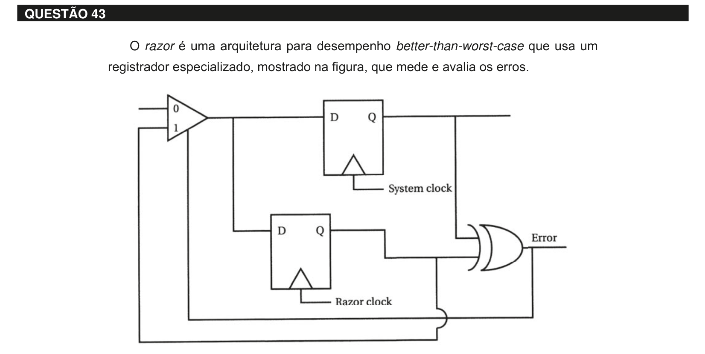

# Questão 43

O registrador do sistema mantém o valor chaveado e é comandado por um clock de sistema better-than-worst-case. Um registrador adicional é comandado separadamente por um clock ligeiramente atrasado com relação ao do sistema. Se os resultados armazenados nos dois registradores são diferentes, então um erro ocorreu, provavelmente devido à temporização. A porta XOR detecta o erro e faz com que este valor seja substituído por aquele no registrador do sistema. Wolf, W. High-performance embedded computing: architectures, applications, and methodologies. Morgan Kaufmann, 2007 Considerando essas informações, analise as afirmações a seguir. I. Sistemas digitais são tradicionalmente concebidos como sistemas assíncronos regidos por um clock. II. Better-than-worst-case é um estilo de projeto alternativo em que a lógica detecta e se recupera de erros, permitindo que o circuito possa operar com uma frequência maior. III. Nos sistemas digitais, o período de clock é determinado por uma análise cuidadosa para que os valores sejam armazenados corretamente nos registradores, com o período de clock alargado para abranger o atraso de pior caso. É correto o que se afirma em

## Alternativas

A. I, apenas.
B. III, apenas.
C. I e II, apenas.
D. II e III, apenas.
E. I, II e III.
