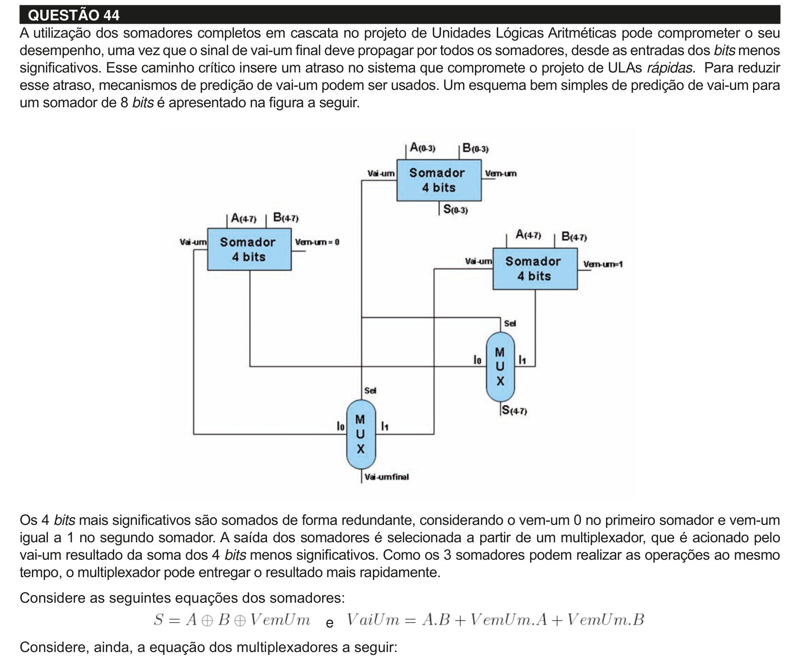

# Questão 44

A utilização dos somadores completos em cascata no projeto de Unidades Lógicas Aritméticas pode comprometer o seu

Suponha que o somador de 8 bits tem predição de vai-um baseada na duplicação da soma dos 4 bits mais significativos e que 7 ns é o tempo de atraso de propagação por nível de porta AND, OR e XOR. Desconsiderando os inversores, o aumento do número de portas e a redução do tempo de propagação podem ser expressos, em porcentagem, como aumento de

## Alternativas

A. 26 portas, representando 65% de acréscimo no número de portas e redução de 112 ns para 70 ns, redução de 47% do tempo para a execução da soma.
B. 20 portas, representando 50% de acréscimo no número de portas e redução de 112 ns para 70 ns, redução de 47% do tempo para a execução da soma.
C. 26 portas, representando 65% de acréscimo no número de portas e redução de 112 ns para 56 ns, redução de 50% do tempo para a execução da soma.
D. 20 portas, representando 50% de acréscimo no número de portas e redução de 112 ns para 56 ns, redução de 50% do tempo para a execução da soma.
E. 26 portas, representando 65% de acréscimo no número de portas. Não há redução no tempo de atraso de propagação para a execução da soma.
