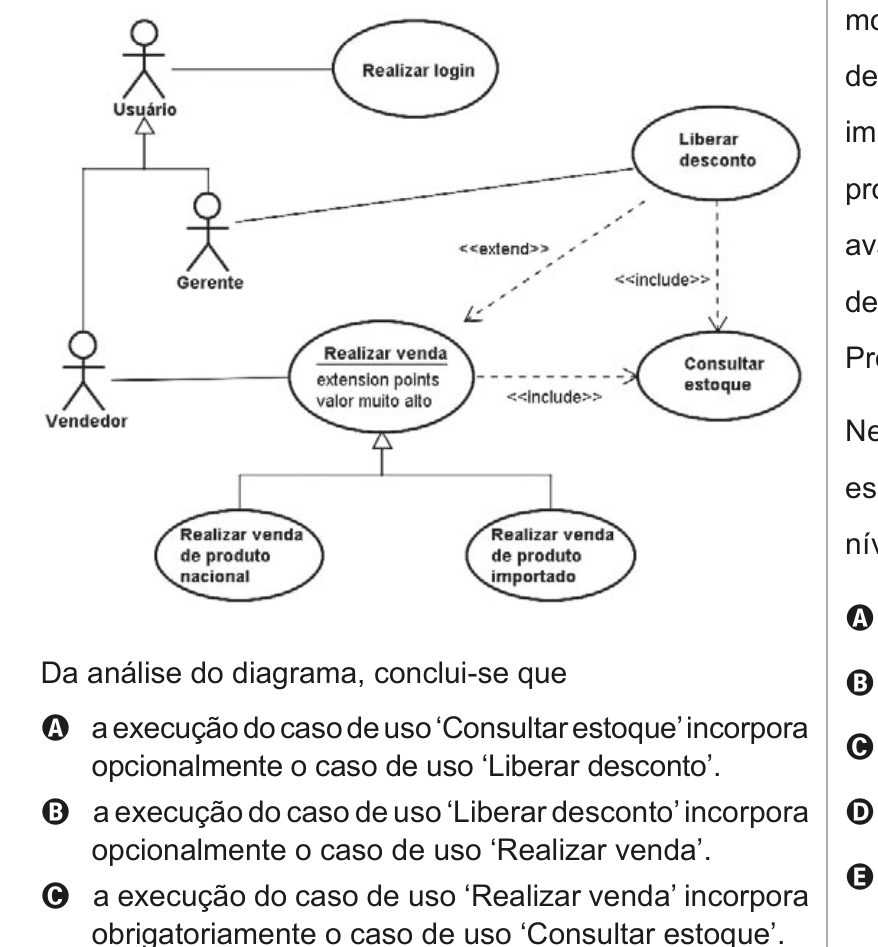

# Questão 48

No desenvolvimento de um software para um sistema de venda de produtos nacionais e importados, o analista gerou o diagrama de casos de uso a seguir.

## Alternativas

A. a execução do caso de uso ‘Consultar estoque’incorpora opcionalmente o caso de uso ‘Liberar desconto’.
B. a execução do caso de uso ‘Liberar desconto’ incorpora opcionalmente o caso de uso ‘Realizar venda’.
C. a execução do caso de uso ‘Realizar venda’ incorpora obrigatoriamente o caso de uso ‘Consultar estoque’.
D. a execução do caso de uso ‘Realizar venda de produto nacional’ incorpora obrigatoriamente o caso de uso ‘Liberar desconto’.
E. um Gerente pode interagir com o caso de uso ‘Realizar venda’, pois ele é um Usuário.
