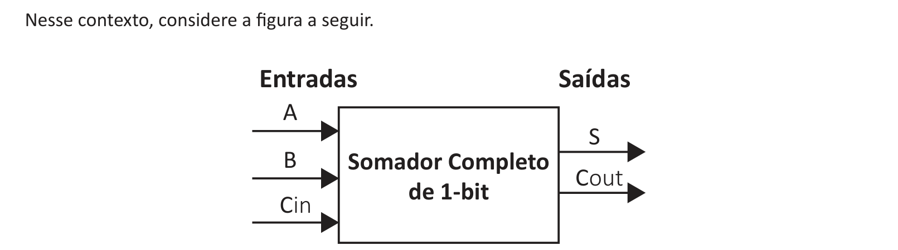

# Questão 4

A soma de dois números binários é feita bit a bit, começando da direita (menos significativo) para a esquerda (mais significativo), passando o transporte, vai um (do inglês, carry out, representado na figura como Cout), para o bit seguinte como vem um (do inglês, carry in, representado na figura como Cin). Uma forma simples de implementar um somador de N bits é implementar N somadores elementares de 1 bit. Cada somador de um bit tem as entradas A, B e carry in (Cin) e as saídas Soma (S) e carry out (Cout). DELGADO, J.; RIBEIRO, C. Arquitetura de Computadores. Rio de Janeiro: LTC, 2009 (adaptado).

A	S B	Somador Completo

Com base no somador completo de 1-bit apresentado na figura, descreva sua tabela verdade e o diagrama do seu circuito lógico. (valor: 10,0 pontos)
