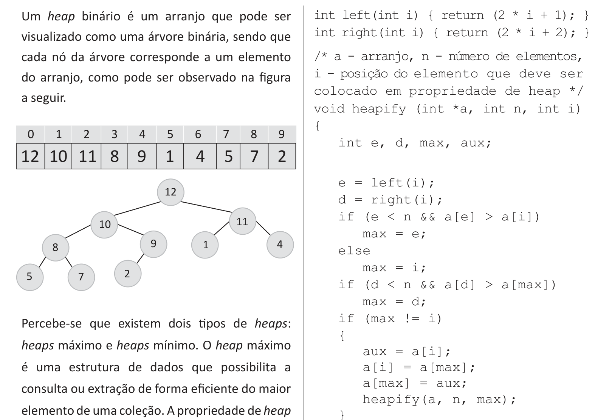

# Questão 5



máximo especifica que um nó filho (no código calculado pelas funções left e right) tem sempre armazenado um valor menor ou igual ao seu pai. CORMEN, T. H.; LEISERSON, C. E.; RIVEST, R. L.; STEIN, C. Introduction to Algorithms. 3. ed. MIT Press and McGraw-Hill. p. 131-161, 2009 (adaptado). Considerando a implementação a seguir, o heapify é uma função auxiliar para reorganizar o arranjo (garantindo a propriedade de heap máximo em uma determinada posição do arranjo) e buildHeap é uma função que usa heapify para reorganizar todas as posições do arranjo (garantindo a propriedade de heap máximo para todos os elementos).

```
}
/a - arranjo, n - número de elementos */
void buildHeap(int *a, int n)
{
   int i;
   for (i = (n-1)/2; i >= 0; i--)
      heapify(a, n, i);
}
```

De acordo com as informações apresentadas, faça o que se pede nos itens a seguir. a) Como ficará o arranjo int a[ ] = {2, 5, 8 ,13, 21, 1, 3, 34} após a execução da função buildHeap(a, 8). (valor: 5,0 pontos) b) Apresente a complexidade de tempo no pior caso para a função heapify, use a notação O ou Q. (valor: 5,0 pontos)
