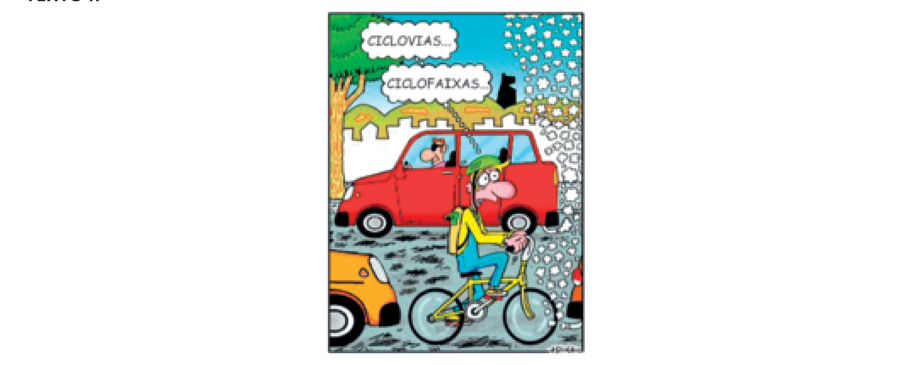

# Questão 3

tEXtO i Na Alemanha nazista, no auge da Segunda Guerra Mundial, surgiu a necessidade de abrir mais espaço para os veículos automoti vos. Com muitos ciclistas, as bicicletas viraram um empecilho, forçando a

ati vidade fí sica. III.  A parti r da Segunda Guerra Mundial, durante o governo da Alemanha nazista, o uso da bicicleta como meio de transporte tornou-se efi caz e passou a prevalecer nas cidades europeias. É correto o que se afi rma em

## Alternativas

A. I, apenas.
B. II, apenas.
C. I e III, apenas.
D. II e III, apenas.
E. I, II e III.
