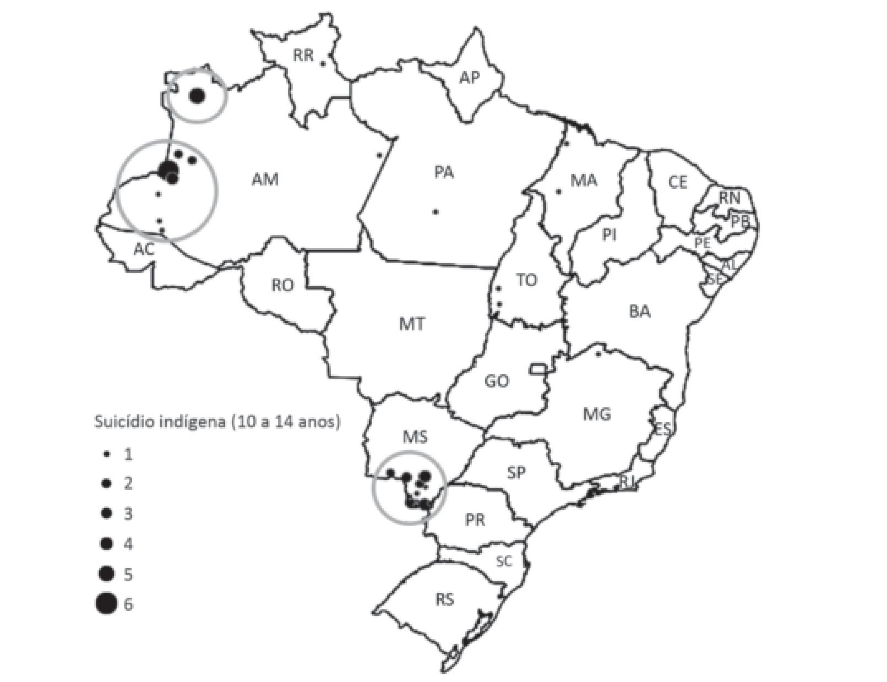

# Questão 5

tEXtO i Segundo o Ministério da Saúde, em 2017 o Brasil registrou uma média nacional de 5,7 óbitos para 100 mil habitantes. Na população indígena, foi registrado um número de óbitos três vezes maior que a média nacional – 15,2. Destes registros, 44,8% (aproximadamente, 6,8 óbitos), são suicídios de crianças e adolescentes entre 10 e 19 anos. Esses dados contrastam com o panorama nacional, em que o maior índice é entre adolescentes e adultos de 15 a 20 anos. Disponível em: htt ps://www.cvv.org.br/blog/o-suicidio-do-povo-indigena/. Acesso em: 30 de abr. 2020 (adaptado).

SOUZA, M. Mortalidade por suicídio entre crianças indígenas no Brasil. Caderno de Saúde pública, v.35, Rio de Janeiro, 2019 (adaptado).

Considerando as informações apresentadas e o alto índice de suicídio da população indígena, avalie as afi rmações a seguir. I.  O elevado índice de suicídios entre crianças e adolescentes indígenas no país evidencia a necessidade de ações com foco nos direitos fundamentais desses indivíduos. II.  Os estados do Pará e de Tocanti ns são os que possuem os maiores índices de suicídio de indígenas na faixa etária de 10 a 14 anos. III.  Os povos das tribos originárias do Brasil, no que tange a sua história e preservação cultural, não estão amparados por direitos e garantias constitucionais. IV.  O estabelecimento de ações preventi vas ao suicídio nas comunidades indígenas deve considerar os elementos globais que afetam a população em geral, na faixa etária entre 15 e 20 anos. É correto apenas o que se afi rma em

## Alternativas

A. I.
B. II.
C. I e III.
D. II e IV.
E. III e IV.
