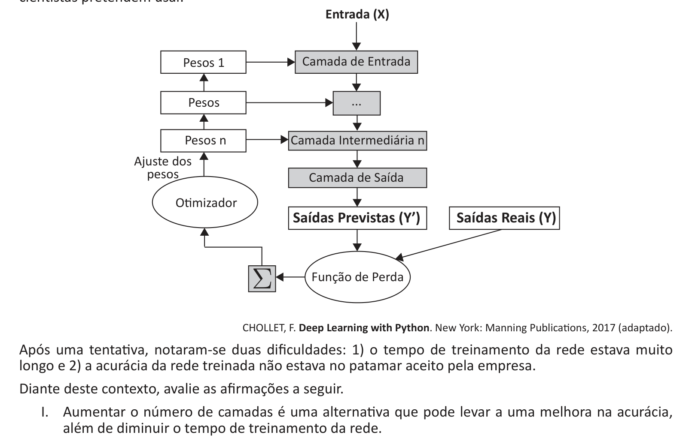

# Questão 11

Uma equipe de cientistas da computação de uma determinada empresa de animação foi designada para desenvolver um sistema capaz de varrer a web no intuito de detectar sites que possam estar usando imagens de seus personagens de animação sem o devido consentimento. Portanto, o sistema deverá receber imagens como entrada, classificá-las entre imagens da empresa e imagens não

A figura abaixo esboça uma arquitetura de rede neural profunda e o processo de treinamento que os

no entanto, pode exigir uso de máquinas com maior poder de processamento. III.	 Aumentar o número de unidades de processamento (neurônios) nas camadas pode levar a uma piora na acurácia, além de diminuir o tempo de treinamento da rede. IV.	 Aumentar o número de amostras de treinamento é uma alternativa que pode levar a uma melhora na acurácia, apesar de aumentar o tempo de treinamento da rede. V.	 Fazer uso de redes recorrentes é uma alternativa que pode levar a uma melhora na acurácia, no entanto, pode exigir uso de máquinas com maior poder de processamento. É correto apenas o que se afirma em

## Alternativas

A. I e IV.
B. I e V.
C. II e III.
D. II e IV.
E. III e V.
