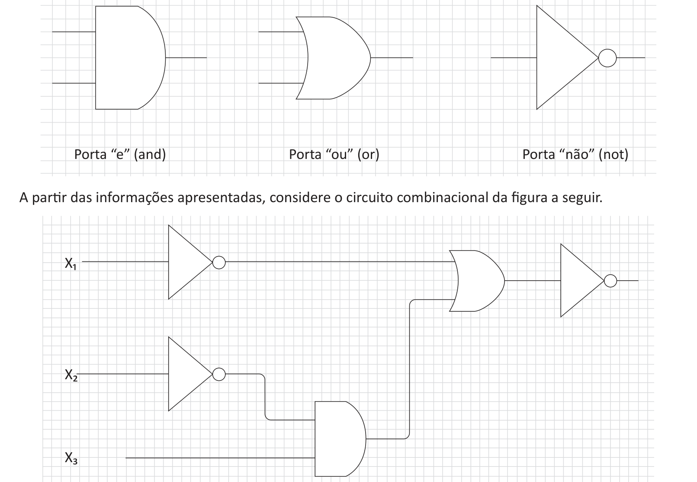

# Questão 16

Em 1938, o matemático americano Claude Shannon notou o paralelismo entre a lógica proposicional e a lógica dos circuitos e percebeu que a álgebra booleana teria um papel importante na sistematização deste ramo da eletrônica. Cada um dos conetivos básicos da lógica são instâncias das operações básicas da álgebra booleana (“+”, “.” e ” ’ ”). Expressões booleanas combinando operações e variáveis podem ser usadas para representar circuitos combinacionais formados por portas lógicas. GERSTING, J. L. Mathematical Structures for Computer Science. New York: W. H. Freeman and Company, 2002. A figura a seguir apresenta as portas básicas.

A partir das informações apresentadas, considere o circuito combinacional da figura a seguir.

Qual das alternativas apresenta a expressão booleana correspondente?

## Alternativas

A. (X3 . X2’) + X1’
B. (X3 . (X2’) + (X1’))’
C. ((X3 . X2)’ + X1’)’
D. (X3 . X2)’ + X1’
E. ((X3 . X2’)’ + X1’)’
