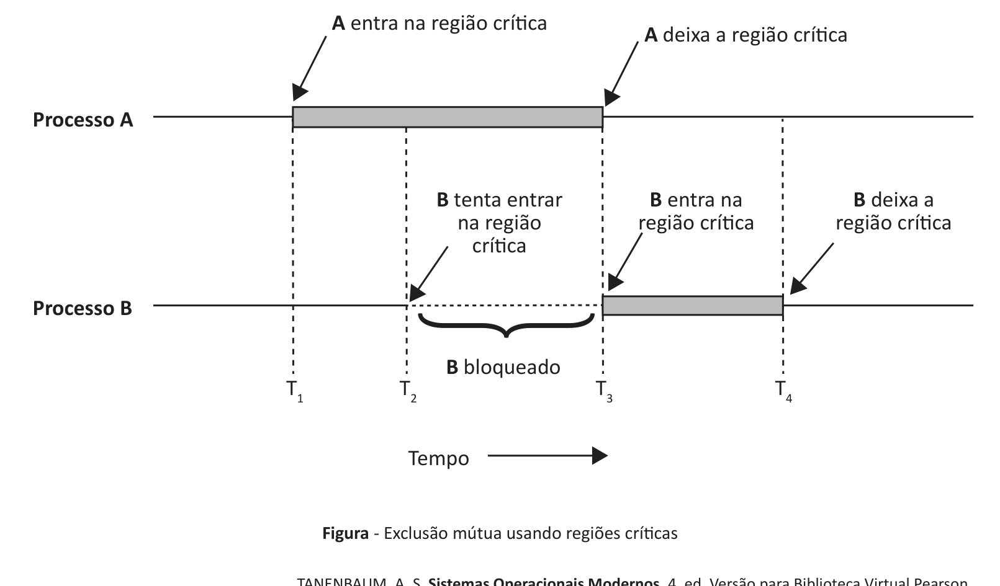

# Questão 17

Durante parte do tempo, um processo está ocupado realizando computações internas e outras coisas que não levam a condições de corrida. No entanto, às vezes, um processo tem de acessar uma memória compartilhada ou arquivos, ou realizar outras tarefas críticas que podem levar a corridas. Essa parte do programa onde a memória compartilhada é acessada é chamada de região crítica ou seção crítica. Se conseguíssemos arranjar as coisas de maneira que dois processos jamais estivessem em suas regiões críticas ao mesmo tempo, poderíamos evitar as corridas. Embora essa exigência evite as condições de corrida, ela não é suficiente para garantir que processos em paralelo cooperem de modo correto e eficiente usando dados compartilhados. Precisamos que quatro condições se mantenham para chegar a uma boa solução. 1. Dois processos jamais podem simultaneamente estar dentro de suas regiões críticas. 2. Nenhuma suposição pode ser feita a respeito de velocidades ou de número de CPUs. 3. Nenhum processo executando fora de sua região crítica pode bloquear qualquer processo. 4. Nenhum processo deve ser obrigado a esperar eternamente para entrar em sua região crítica. Em um sentido abstrato, o comportamento que queremos é mostrado na figura a seguir.

A entra na região crítica A deixa a região crítica

Processo A

B tenta entrar B entra na B deixa a

Processo B B bloqueado

São Paulo: Pearson Education do Brasil, p. 83, 2016 (adaptado).

Considerando o texto e a figura apresentados, avalie as asserções a seguir e a relação proposta entre elas. I. Em algumas situações, a exclusão mútua pode ser obtida por meio da desabilitação da interrupção controlada pelo Sistema Operacional, não sendo permitido que o seu controle seja feito pelo usuário. PORQUE II. A desabilitação da interrupção é uma técnica que pode impedir que o processador que está executando um processo em sua região crítica seja interrompido para executar outro código, sendo mais eficiente em sistemas de multiprocessadores devido a quantidade de processos concorrentes. A respeito dessas asserções, assinale a opção correta.

## Alternativas

A. As asserções I e II são proposições verdadeiras, e a II é uma justificativa correta da I.
B. As asserções I e II são proposições verdadeiras, mas a II não é uma justificativa correta da I.
C. A asserção I é uma proposição verdadeira, e a II é uma proposição falsa.
D. A asserção I é uma proposição falsa, e a II é uma proposição verdadeira.
E. As asserções I e II são proposições falsas.
