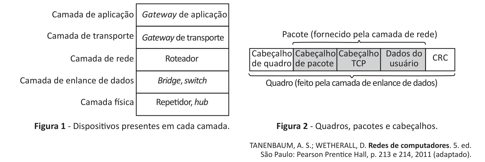

# Questão 21

No projeto de redes de computadores, a escolha racional do dispositivo de conexão a ser utilizado é fundamental para o correto funcionamento da rede, bem como para a sua segurança e eficiência. Dispositivos como repetidores, hubs, bridges, switches, roteadores e gateways são muito comuns, mas diferem entre si em detalhes sutis e não muito sutis. Por existir uma grande quantidade desses dispositivos, vale a pena conhecer suas características principais, entender o seu funcionamento e saber quando e como são utilizados. A chave para entender esses dispositivos é observar que eles operam em camadas diferentes, como ilustra a figura 1. A camada é importante, porque diferentes dispositivos utilizam fragmentos de informações diferentes para decidir como realizar a comutação. Em um cenário típico, o usuário gera alguns dados a ser enviados para uma máquina remota. Esses dados são repassados à camada de transporte, que então acrescenta um cabeçalho (por exemplo, um cabeçalho TCP) e repassa o pacote resultante à camada de rede situada abaixo dela. Essa camada adiciona seu próprio cabeçalho para formar um pacote da camada de rede (por exemplo, um pacote IP). Na figura 2, vemos o pacote IP sombreado. Em seguida, o pacote vai para a camada de enlace de dados, que adiciona seu próprio cabeçalho e seu checksum (CRC) e entrega o quadro resultante à camada física para transmissão, digamos, por uma LAN.

Considerando o contexto das informações e da figura apresentadas, assinale a alternativa correta.

## Alternativas

A. Os repetidores não reconhecem quadros ou pacotes, apenas o seu próprio cabeçalho.
B. Um hub tem várias interfaces de entrada/saída conectadas eletricamente; os quadros que chegam a qualquer uma dessas interfaces são enviados a todas as outras e, se dois quadros chegarem ao mesmo tempo, eles serão colocados em buffer de espera e arbitragem de enlace.
C. Uma bridge conecta duas ou mais redes, diferentemente de um hub, cada porta é isolada das demais para criar um domínio próprio de colisão; ela só envia o quadro à porta onde ele é necessário, e pode encaminhar vários quadros ao mesmo tempo, além de examinar o campo de carga útil (pacotes de rede) dos quadros que encaminha, para obter o endereço do destinatário.
D. Os roteadores examinam os endereços em pacotes e efetuam o roteamento com base nesses endereços, de modo que eles só trabalham com os protocolos para os quais foram projetados para lidar; nas redes de broadcast, o problema de roteamento é mais complicado e cabe à camada de rede operar com algoritmos de roteamento apropriados.
E. Os gateways de transporte conectam dois computadores que utilizam diferentes protocolos de transporte orientados a conexões, por exemplo, um computador que utiliza o protocolo TCP/IP orientado a conexões pode se comunicar com um computador que utiliza um protocolo de transporte orientado a conexões diferentes, chamado SCTP.
