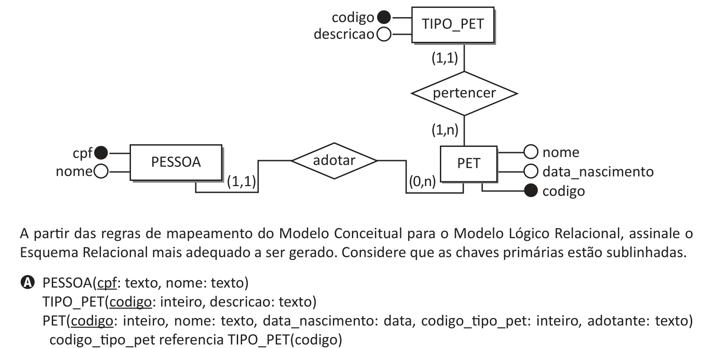

# Questão 22

Uma Organização Não Governamental (ONG), relacionada à causa animal, registra os pets (animais de estimação) amparados por ela, de acordo com o seguinte Diagrama Entidade Relacionamento (DER).

A partir das regras de mapeamento do Modelo Conceitual para o Modelo Lógico Relacional, assinale o

## Alternativas

A. PESSOA(cpf: texto, nome: texto) adotante referencia PESSOA(cpf)
B. PET(codigo: inteiro, nome: texto, data_nascimento: data) PESSOA(cpf: texto, nome: texto, codigo_pet: inteiro) codigo_pet referencia PET(codigo) TIPO_PET(codigo: inteiro, descricao: texto, codigo_pet: inteiro) codigo_pet referencia PET(codigo)
C. TIPO_PET(codigo: inteiro, descricao: texto) PET(codigo: inteiro, nome: texto, data_nascimento: data, codigo_tipo_pet: inteiro) codigo_tipo_pet referencia TIPO_PET(codigo) PESSOA(cpf: texto, nome: texto, codigo_pet: inteiro) codigo_pet referencia PET(codigo)
D. PET_PESSOA(codigo_pet: inteiro, nome_pet: texto, data_nascimento: data, cpf: texto, nome_pessoa: texto, codigo_tipo_pet: inteiro, descricao_tipo_pet: texto)
E. PESSOA(cpf: texto, nome: texto) PET(codigo: inteiro, nome: texto, data_nascimento: data, codigo_tipo_pet: inteiro, descricao_tipo_pet, adotante: texto) adotante referencia PESSOA(cpf)
