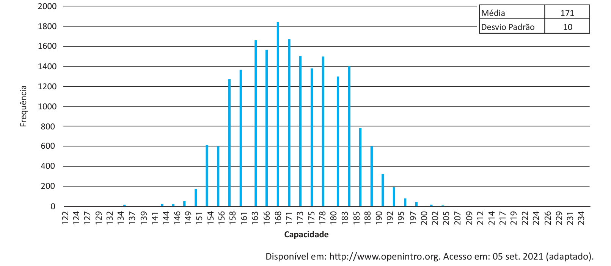

# Questão 27

A figura a seguir mostra o histograma de uma amostra composta de 20 000 servidores. O eixo x apresenta a quantidade de requisições simultâneas desses servidores. Por exemplo, o valor 168 indica que há 1 850 servidores com capacidade de atender 168 requisições simultâneas. 2000

É possível afirmar que ao conectarmo-nos a um servidor dessa amostra, ao acaso, há aproximadamente

## Alternativas

A. 34,13% de chance que sua capacidade esteja no intervalo [141, 201].
B. 34,13% de chance que sua capacidade esteja no intervalo [161, 181].
C. 76,68% de chance que sua capacidade esteja no intervalo [171, 191].
D. 95,44% de chance que sua capacidade esteja no intervalo [151, 191].
E. 99,74% de chance que sua capacidade esteja no intervalo [161, 181].
