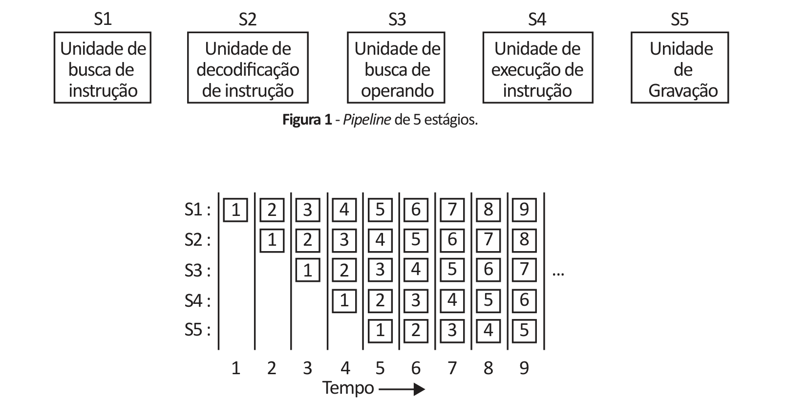

# Questão 28

A figura 1 ilustra um pipeline com cinco unidades, também denominadas estágios. O estágio 1 busca a instrução na memória e a coloca em um buffer até que ela seja necessária. O estágio 2 decodifica a instrução, determina seu tipo e de quais operandos ela necessita. O estágio 3 localiza e busca os operandos, seja nos registradores, seja na memória. O estágio 4 é que realiza o trabalho de executar a instrução, normalmente fazendo os operandos passar pelo caminho de dados. Por fim, o estágio 5 escreve o resultado de volta no registrador adequado. Na figura 2, vemos como o pipeline funciona em função do tempo. Durante o ciclo de relógio 1, o estágio S1 está trabalhando na instrução 1, buscando-a na memória. Durante o ciclo 2, o estágio S2 decodifica a instrução 1, enquanto o estágio S1 busca a instrução 2. Durante o ciclo 3, o estágio S3 busca os operandos da instrução 1, o estágio S2 decodifica a instrução 2, e o estágio S1 busca a terceira instrução. Durante o ciclo 4, o estágio S4 executa a instrução 1, S3 busca os operandos para a instrução 2, S2 decodifica a instrução 3 e S1 busca a instrução 4. Por fim, durante o ciclo 5, S5 escreve (grava) o resultado da instrução 1 de volta no registrador, enquanto os outros estágios trabalham nas instruções seguintes.

Figura 2 - Estado de cada estágio como uma função do tempo. São ilustrados 9 ciclos do relógio. TANENBAUM, A. S. Organização Estruturada de Computadores. 5. ed. São Paulo: Pearson Prentice Hall, p. 35, 2007 (adaptado). Considerando o modelo teórico do pipeline apresentado, avalie as afirmações a seguir. I. Uma falta na busca de instrução (nenhuma instrução buscada), em determinado ciclo, causará uma bolha (ausência de instrução útil) no estágio S1, e essa bolha percorrerá todos os estágios seguintes, um após o outro, nos próximos 4 ciclos, até ser eliminada do pipeline. II. Cada instrução leva 5 ciclos para ser executada, mas se alguma instrução não precisar passar por determinado estágio, ela poderá percorrer o pipeline em um número menor de ciclos, por exemplo, se a instrução não possuir operandos ela não precisará passar pelo estágio S3 e assim poderá ser movida diretamente para o estágio S4. III. Dispondo de cache de dados separada da cache de instruções, o estágio S1 busca instruções na cache de instruções e dados na cache de dados. IV. Dispondo de BTB (branch target buffer), após a busca de uma instrução de desvio condicional, as instruções seguintes podem ser buscadas e colocadas no pipeline, o que evita bolhas em seus vários estágios. É correto apenas o que se afirma em

## Alternativas

A. I e II.
B. I e IV.
C. III e IV.
D. I, II e III.
E. II, III e IV.
