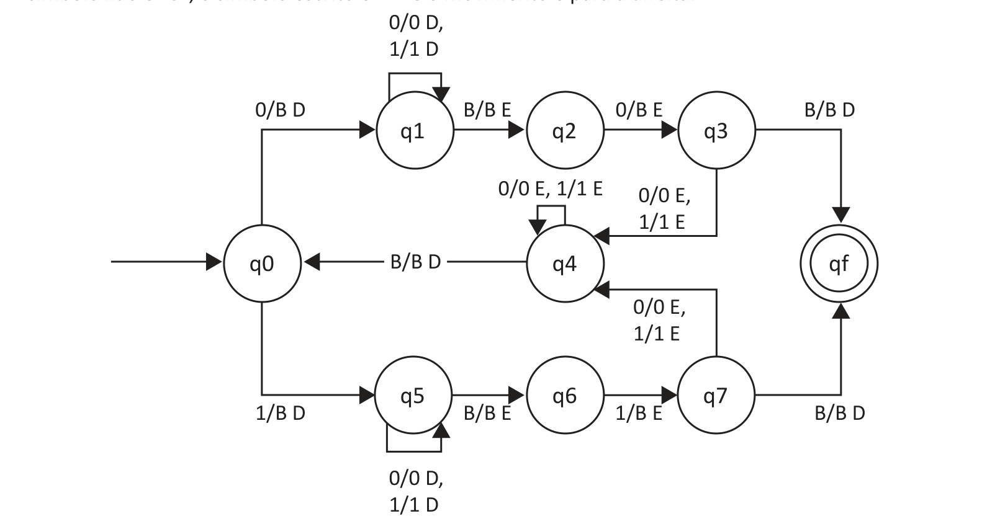

# Questão 31

Semelhante a um autômato finito mas com uma memória ilimitada e irrestrita, uma máquina de Turing é um modelo muito mais preciso de um computador de propósito geral. Uma máquina de Turing pode fazer tudo o que um computador real pode fazer, entretanto mesmo ela não pode resolver certos problemas. Num sentido muito real, esses problemas estão além dos limites teóricos da computação. SIPSER, M. Introdução à Teoria da Computação. 2. ed. norte-americana. Cengage CTP, 2007 (adaptado). Considere a seguinte máquina de Turing M que aceita apenas números binários palíndromos cujo comprimento é par. Observação: no diagrama, as transições estão representadas no seguinte formato: "Leitura/Escrita Movimento", onde direção pode ser "D" (direita) ou "E" (esquerda). Exemplo: "0/B D" significa que o símbolo lido é "0", o símbolo escrito é "B" e o movimento é para a direita.

Considerando que o estado inicial de M é q0, que a sua fita se encontra inicializada com a entrada 110011 e infinitos símbolos "B" à esquerda e à direita, e que a cabeça de leitura encontra-se inicialmente no símbolo mais à esquerda da entrada, avalie as afirmações a seguir. I. Após 4 movimentos de M, o conteúdo da fita, excluindo-se os símbolos "B", é "110011". II. Após 8 movimentos de M, o conteúdo da fita, excluindo-se os símbolos "B", é "1001". III. A máquina irá certamente travar em um estado de aceitação. IV. Existe um autômato com pilha que também aceita a linguagem de M. É correto apenas o que se afirma em

## Alternativas

A. I e II.
B. I e IV.
C. II e III.
D. I, III e IV.
E. II, III e IV.
