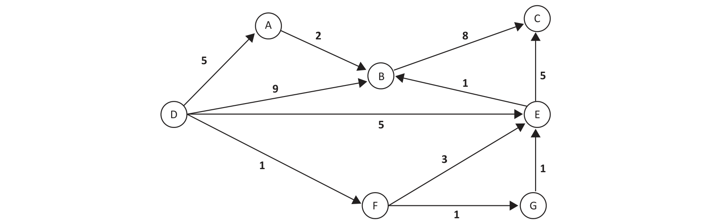

# Questão 34

O algoritmo de Dijkstra para o problema do caminho mínimo em dígrafos com pesos utiliza uma fila de prioridades de vértices, na qual as prioridades são uma estimativa do custo final. A cada iteração, um vértice é retirado da fila, e os arcos que começam nesse vértice são analisados. Considere o seguinte grafo, no qual deseja-se conhecer o custo de um caminho mínimo para cada vértice, a partir do vértice D. Considere que -1 representa um custo “infinito”, ou seja, nenhum caminho até o vértice foi até o momento descoberto.

C	8 A	2 B	5 E	9 D	5

Com base nas informações e no grafo apresentados, assinale a alternativa que representa a estimativa de custo após duas iterações do algoritmo.

## Alternativas

A. A: 5 B: 6 C: 10 D: 0 E: 4 F: 1 G: -1
B. A: 5 B: 9 C: -1 D: 0 E: 5 F: 1 G: -1
C. A: 5 B: 9 C: -1 D: 0 E: 4 F: 1 G: 2
D. A: 5 B: 7 C: 8 D: 0 E: 4 F: 1 G: 2
E. A: 5 B: 6 C: 8 D: 0 E: 3 F: 1 G: 2
