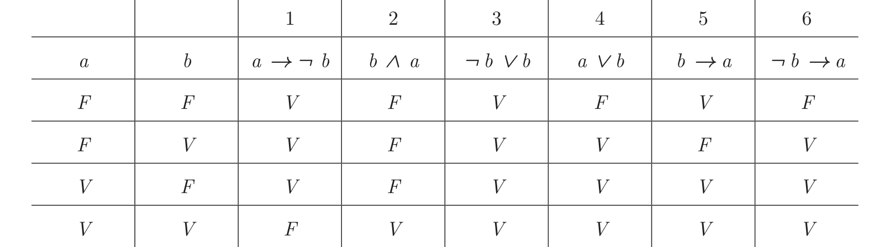

# Questão 3

Um corpo de conhecimento representado na lógica proposicional utiliza os conectivos lógicos de implicação ( → ) que representa o condicional, conjunção ( ∧ ) que representa o operador lógico AND, a disjunção ( ∨ ) que representa o operador lógico OR e a negação ( ¬ ) que representa o operador lógico NOT. Seja P o seguinte conjunto de fórmulas da lógica proposicional: 1.a → ¬ b 2.b ∧ a 3.¬ b ∨ b seja Q o seguinte conjunto de fórmulas da lógica proposicional: 4.a ∨ b 5.b → a e seja R a fórmula 6.¬ b → a Veja a tabela-verdade para estas fórmulas.

|  |  | 1 | 2 | 3 | 4 | 5 | 6 |
| --- | --- | --- | --- | --- | --- | --- | --- |
| a | b | a → ¬ b | b ∧ a | ¬ b ∨ b | a ∨ b | b → a | ¬ b → a |
| F | F | V | F | V | F | V | F |
| F | V | V | F | V | V | F | V |
| V | F | V | F | V | V | V | V |
| V | V | F | V | V | V | V | V |

Sabe-se que cada linha da tabela-verdade corresponde a uma atribuição de valores-verdade para os símbolos proposicionais (a e b) e cada coluna corresponde à avaliação da fórmula para esta atribuição. Algumas definições: (i) Uma fórmula é uma tautologia se e somente se, para toda atribuição de valores-verdade, sua avaliação é verdadeira. (ii) Uma atribuição de valores-verdade satisfaz a um conjunto de fórmulas se e somente se, para toda fórmula no conjunto, a avaliação é verdadeira. (iii) Um conjunto de fórmulas é satisfazível se e somente se existe uma atribuição de valores-verdade que satisfaz o conjunto. Em caso contrário, ele é insatisfazível. (iv) Uma fórmula é uma consequência lógica de um conjunto de fórmulas se e somente se, para toda atribuição de valores-verdade, se a atribuição satisfaz o conjunto então satisfaz a fórmula.

Com base nas informações apresentadas, responda os itens a seguir. a) Há alguma tautologia nas fórmulas 1 a 6? Justifique sua resposta. (valor: 2,5 pontos) b) Há algum conjunto (P ou Q) satisfazível? Justifique sua resposta. (valor: 2,5 pontos) c) Há algum conjunto (P ou Q) insatisfazível? Justifique sua resposta. (valor: 2,5 pontos) d) A fórmula 6 é consequência lógica de Q? Justifique sua resposta. (valor: 2,5 pontos)
