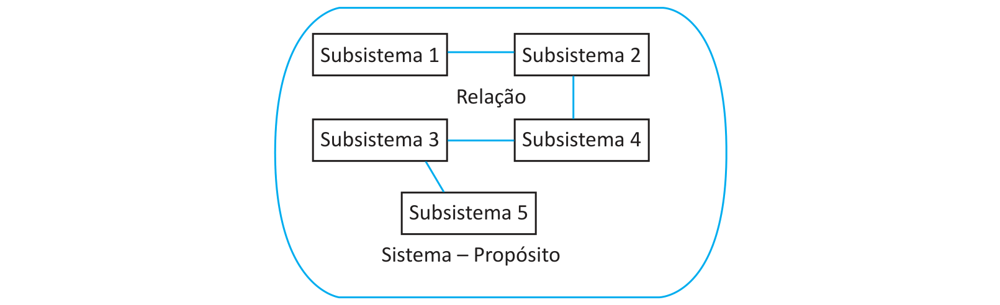

# Questão 4

O conceito de sistemas pode ser enunciado por uma definição muito simples, porém de grande relevância. A ideia essencial da Teoria Geral de Sistemas é estabelecer uma nova visão da realidade, que transcenda os problemas tecnológicos das várias ciências e tenha generalidade suficiente para ser transdisciplinar. Um sistema é um conjunto de elementos interpendentes e interagentes, com vistas a atingir o mesmo objetivo. A função básica de um sistema é a de converter os insumos retirados de seu ambiente, em produtos de natureza qualitativa ou quantitativa diferente de seus insumos, para serem, então, devolvidos ao seu ambiente. MARTINELLI, D. P. et al. Teoria Geral dos Sistemas. São Paulo: Saraiva, 2012 (adaptado). A figura a seguir é uma representação genérica de um sistema.

Considerando as informações apresentadas, redija um texto sobre sistema de informação. Em seu texto, explique o que é subsistema e defina os conceitos de relação e de propósito. (valor: 10,0 pontos)
