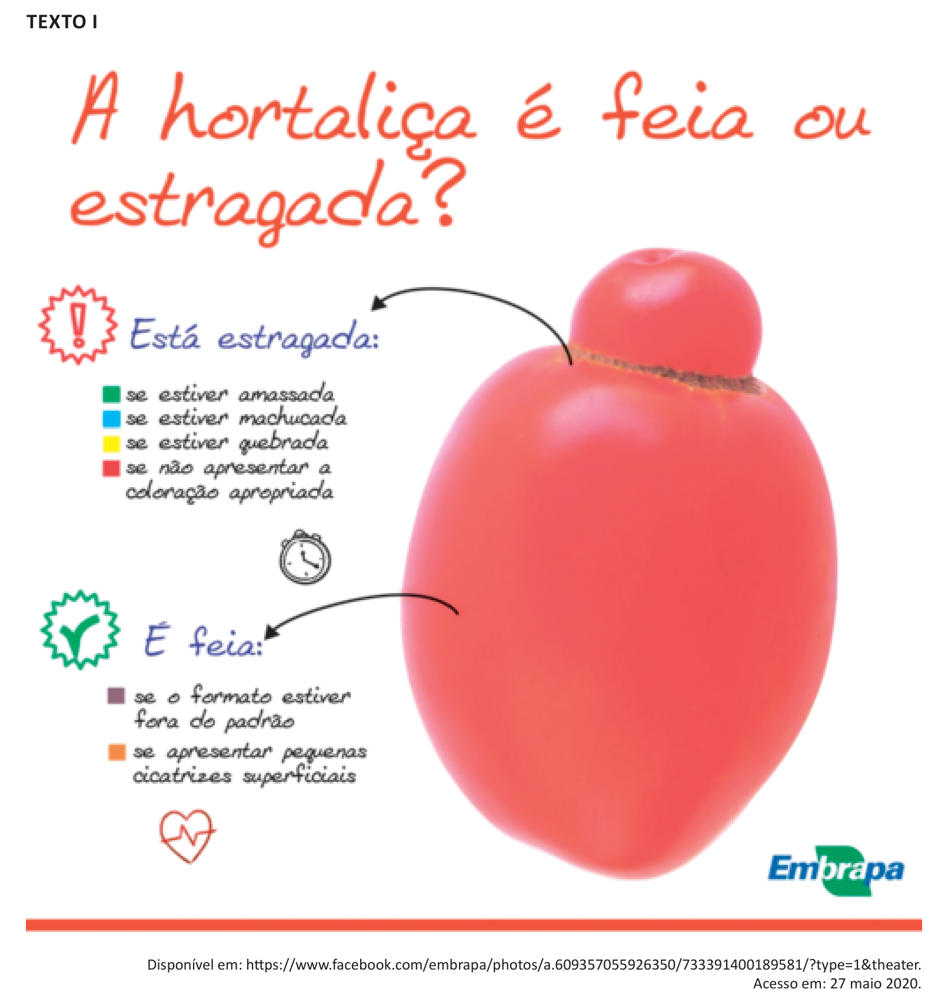

# Questão 2

TEXTO II Em alguns países da Europa, permite-se que um produto de menor valor estético seja comercializado. Estamos falando de um pepino deformado ou de uma cebola pequena, mas não de um produto contaminado com resíduos químicos ou agentes biológicos. No caso do Brasil, o problema vai além da aparência, porque há hortaliças ruins – contaminadas, murchas, machucadas – que chegam às bancas para ser comercializadas. Mas, se nos dois contextos há perda de alimentos e preconceito em relação às hortaliças fora do padrão visual, mas boas para o consumo, quais seriam as alternativas para evitar o desperdício e melhorar a qualidade dos produtos? Para os pesquisadores do assunto, não adianta replicar a experiência europeia no Brasil, de exigir hortaliças esteticamente perfeitas, porque também teríamos produtos sendo desprezados ainda na etapa de produção. Não devemos passar de um mercado pouco exigente, que gera desperdício no varejo e nas residências, para um mercado exigente que gera perda no campo. A solução do problema é conscientizar os diversos elos da cadeia produtiva, especialmente varejistas e consumidores, para que sejam esclarecidos sobre quais aspectos da aparência das hortaliças comprometem a qualidade. Quanto maior a exigência do mercado por hortaliças de aparência perfeita, maior o desperdício de alimentos. Por sua vez, quanto maior a exigência por hortaliças sem danos, causados pela falta de cuidado e pela falta de higiene, menor será a perda de alimentos e maior a qualidade da alimentação da população brasileira. Disponível em: https://www.embrapa.br/busca-de-noticias/-/noticia/29626389/manuseio-correto-preserva-a-qualidade-e -a-vida-util-das-hortalicas. Acesso em: 27 maio 2020 (adaptado). Considerando as informações apresentadas nos textos, avalie as asserções a seguir e a relação proposta entre elas. I. O texto I sintetiza uma informação principal do texto II, ao apresentar critérios distintivos de alterações visuais que têm efeitos puramente estéticos em produtos alimentícios daquelas que têm implicações na qualidade desses produtos. PORQUE II. O texto II divulga que o aumento das perdas na cadeia produtiva de hortaliças no Brasil é proporcional à elevação de exigências dos consumidores pela aparência de produtos agropecuários. A respeito dessas asserções, assinale a opção correta.

## Alternativas

A. As asserções I e II são proposições verdadeiras, e a II é uma justificativa correta da I.
B. As asserções I e II são proposições verdadeiras, mas a II não é uma justificativa correta da I.
C. A asserção I é uma proposição verdadeira, e a II é uma proposição falsa.
D. A asserção I é uma proposição falsa, e a II é uma proposição verdadeira.
E. As asserções I e II são proposições falsas.
