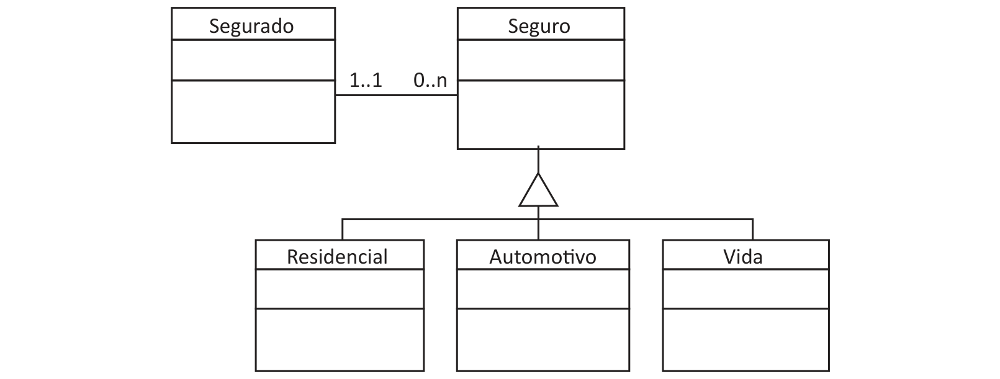

# Questão 9

O gestor de uma instituição seguradora solicitou ao desenvolvedor de software o projeto de uma solução computacional para a instituição. Após executar a análise de requisitos, esse desenvolvedor esboçou o diagrama UML (Unified Modeling Language), contendo os elementos apresentados na figura a seguir.

Em relação ao que é proposto no diagrama, avalie as afirmações a seguir. I. A classe Seguro é a superclasse de uma hierarquia de herança múltipla. II. O mecanismo de ligação entre as classes Segurado e Seguro é a associação. III. As subclasses Residencial, Automotivo e Vida devem ser implementadas como classes abstratas. IV. É permitido que um Segurado possa adquirir várias apólices de Seguro. É correto apenas o que se afirma em

## Alternativas

A. I e III.
B. II e III.
C. II e IV.
D. I, II e IV.
E. I, III e IV.
