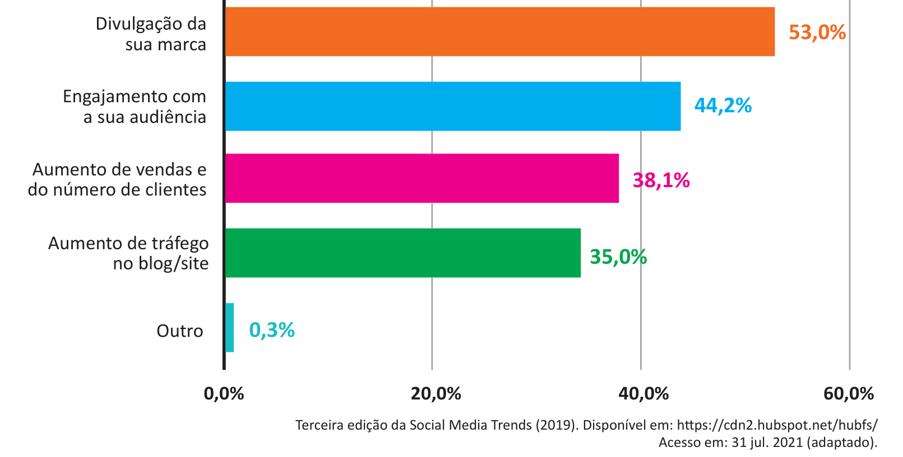

# Questão 10

Na atual conjuntura, as organizações são pressionadas a assumirem posicionamentos cada vez mais resilientes, responsivos e inovadores. Para tanto, elas devem se empenhar na assimilação dos estímulos do ambiente (mercados físicos ou virtuais), na avaliação de suas potencialidades e limitações, bem como na proposição de valor que atenda as expectativas e seus clientes. O gráfico a seguir apresenta os principais benefícios para as empresas em relação ao uso de redes sociais.

Considerando as informações apresentadas, avalie as afirmações a seguir. I. As redes sociais apresentam-se como oportunidades para a área de inteligência organizacional e competitiva, demandando uma nova arquitetura de informação nas organizações. II. A interação dinâmica dos usuários pelas redes sociais fornece subsídios não apenas de consumidores, mas também de colaboradores e pode ser utilizada para análise e tomada de decisão. III. A adoção de redes sociais pelas empresas demonstra a sua capacidade técnica para adotar esses dados no planejamento estratégico e na arquitetura da informação. IV. A inteligência organizacional e competitiva está baseada na capacidade de as organizações monitorarem e analisarem as informações para que se adaptem e se desenvolvam de forma sustentável. É correto apenas o que se afirma em

## Alternativas

A. I e IV.
B. II e III.
C. III e IV.
D. I, II e III.
E. I, II e IV.
