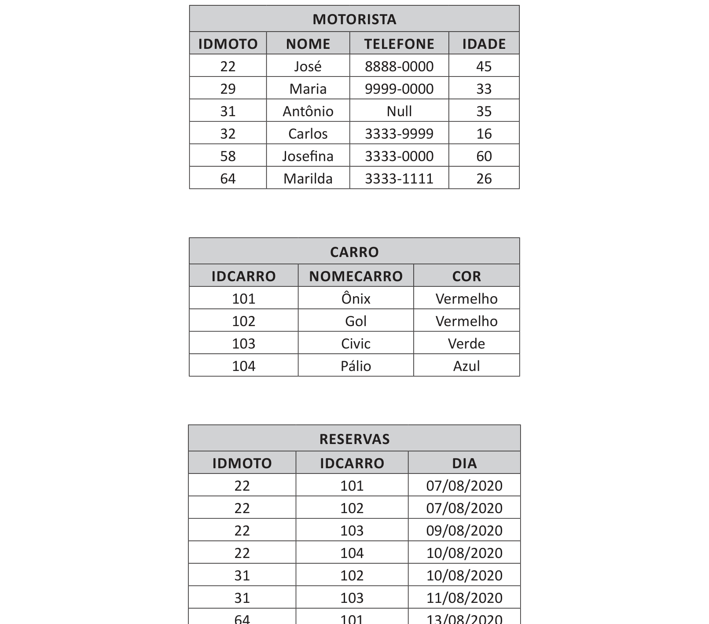

# Questão 23

É possível recuperar conjuntos de dados de forma organizada e que façam sentido para gerar informações. Nesse contexto, a recuperação de informações gravadas nos bancos de dados ocorre por meio de consultas SQL - Structured Query Language (linguagem de consulta de dados estruturados). Considere o seguinte conjunto de tabelas de banco de dados:

Com base nas informações apresentadas, qual das seguintes consultas traria o nome dos motoristas que reservaram os carros vermelhos?

## Alternativas

A. SELECT M.NOME FROM MOTORISTA M WHERE M.IDMOTO IN (SELECT R.IDMOTO FROM RESERVAS R WHERE R.IDCARRO NOT IN (SELECT C.IDCARRO FROM CARRO C WHERE C.COR = ‘Vermelho’))
B. SELECT M.NOME FROM MOTORISTA M WHERE M.IDMOTO IN (SELECT R.IDMOTO FROM RESERVAS R WHERE R.IDCARRO IN (SELECT C.IDCARRO FROM CARRO C WHERE C.COR = ‘Vermelho’))
C. SELECT M.NOME FROM MOTORISTA M WHERE M.IDMOTO IN (SELECT R.IDMOTO FROM RESERVAS R WHERE R.IDCARRO NOT IN (SELECT C.IDCARRO FROM CARRO C WHERE C.COR = ‘Vermelho’))
D. SELECT M.NOME FROM MOTORISTA M WHERE M.IDMOTO NOT IN (SELECT R.IDMOTO FROM RESERVAS R WHERE R.IDCARRO NOT IN (SELECT C.IDCARRO FROM CARRO C WHERE C.COR = ‘Vermelho’))
E. SELECT M.NOME FROM MARINHEIROS M WHERE M.IDMARI NOT IN (SELECT R.IDMARI FROM RESERVAS R WHERE R.IDBARCO ANY (SELECT B.IDBARCO FROM BARCO B WHERE B.COR = ‘Vermelho’))
