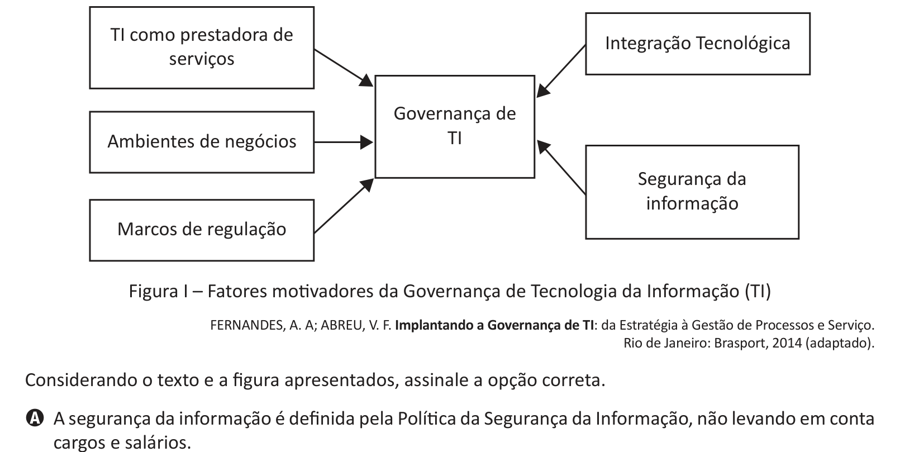

# Questão 28

A Governança de Tecnologia da Informação pode auxiliar nos processos estratégicos das organizações, alinhando controles da TI, como segurança da informação e integração tecnológica, com controles de gestão, como marco de regulação e ambiente de negócio, conforme ilustra a figura a seguir.

## Alternativas

A. A segurança da informação é definida pela Política da Segurança da Informação, não levando em conta cargos e salários.
B. A TI como prestadora de serviços representa os profissionais de informática, não levando em conta hardware e software.
C. A integração tecnológica é definida pela integração entre hardware e software, não levando em conta seus fabricantes.
D. Os marcos de regulação são definidos pelos conselhos das organizações, não levando em conta as regulações políticas.
E. O ambiente de negócio é definido por clientes mais exigentes e conscientes, não levando em conta as políticas internas.
