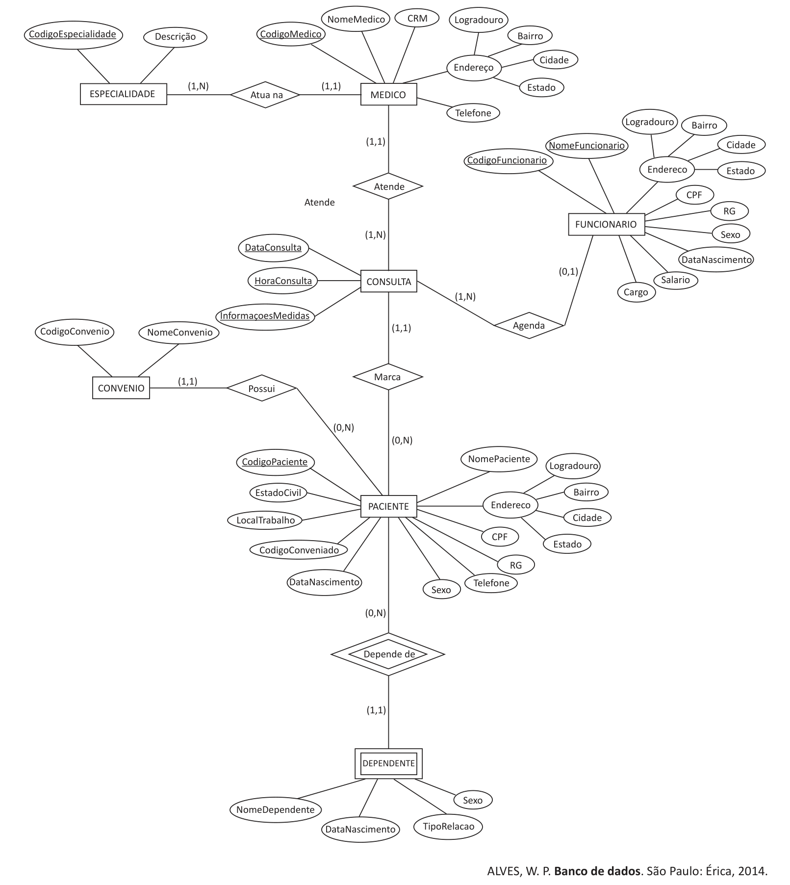

# Questão 29

Suponha que, como projetista de dados, você precisa desenvolver um sistema para uma clínica médica. Após consultar todos os envolvidos, foi proposto o seguinte modelo de entidades e relacionamentos.

Considerando esse contexto e o modelo de entidades e relacionamentos proposto, avalie as afirmações a seguir. I. A restrição de participação da entidade MÉDICO é total, pois um médico precisa atuar em pelo menos uma área da medicina; com relação à ESPECIALIDADE, a restrição é parcial, pois pode haver especialidade sem nenhum médico associado. II. A restrição de participação de PACIENTE é parcial, pois não é obrigatório o PACIENTE ter dependentes; já para DEPENDENTE a restrição é total, uma vez que é preciso ter um responsável (PACIENTE) cadastrado no banco de dados. III. A restrição de participação de PACIENTE é parcial, já que se pode ter o cadastro do paciente no banco de dados sem ter consulta marcada; já para CONSULTA a restrição é total, uma vez que uma consulta somente pode ser agendada para um paciente cadastrado. IV. A razão da cardinalidade é 1:N, pois um paciente pode marcar várias consultas, em dias e horários diferentes, e a consulta (em data e horário específicos) pode ser agendada para vários pacientes. É correto apenas o que se afirma em

## Alternativas

A. I e III.
B. II e IV.
C. III e IV.
D. I, II e III.
E. I, II e IV.
