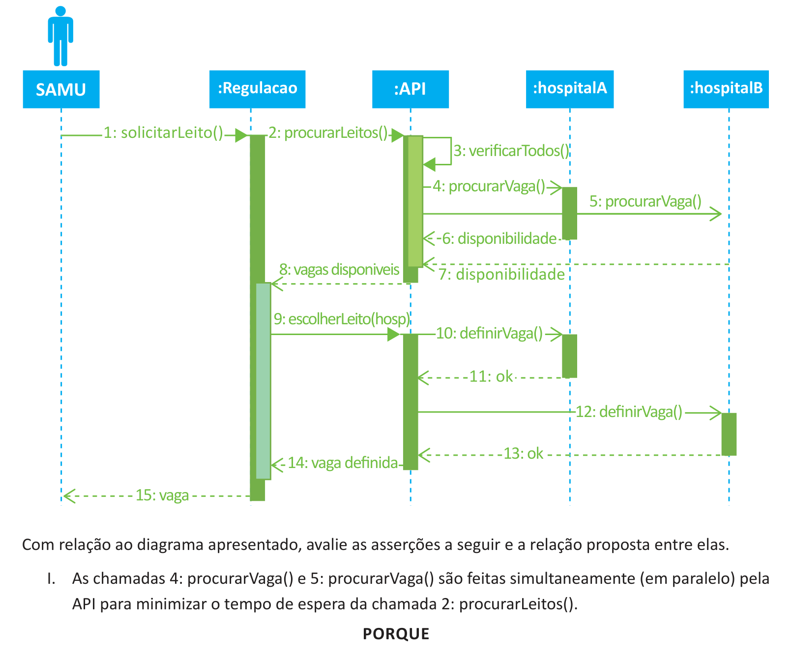

# Questão 32

No desenvolvimento do módulo de integração do sistema do SAMU com os sistemas de hospitais, um analista gerou o seguinte diagrama de sequência.

II. As chamadas 10: definirVaga() e 12: definirVaga() são feitas simultaneamente (em paralelo), mas a espera do retorno é feita em sequência, o que aumentará o tempo de resposta. A respeito dessas asserções, assinale a opção correta.

## Alternativas

A. As asserções I e II são proposições verdadeiras, e a II é uma justificativa correta da I.
B. As asserções I e II são proposições verdadeiras, mas a II não é uma justificativa correta da I.
C. A asserção I é uma proposição verdadeira, e a II é uma proposição falsa.
D. A asserção I é uma proposição falsa, e a II é uma proposição verdadeira.
E. As asserções I e II são proposições falsas.
