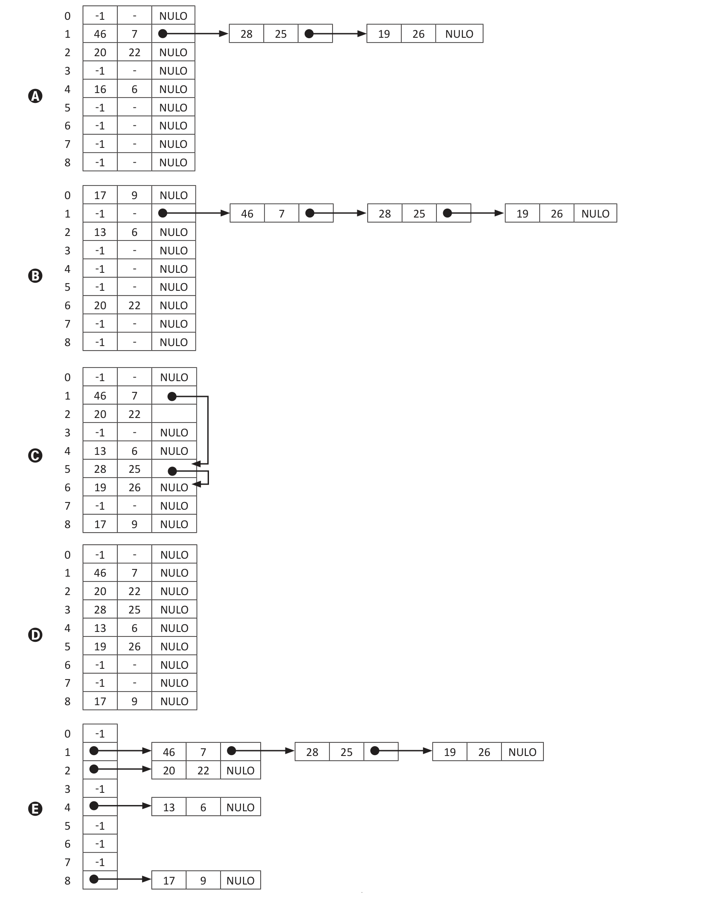

# Questão 33

Uma abordagem calcula a posição da chave na tabela com base no valor da chave. Este valor é a única indicação da posição. Quando a chave é conhecida, a posição na tabela pode ser acessada diretamente, sem fazer qualquer outro teste preliminar, conforme exigido na busca binária ou durante a pesquisa em uma árvore. Precisamos encontrar uma função h que possa transformar uma chave particular K — seja ela uma cadeia de caracteres, um número, um registro etc. — em um índice na tabela usada para armazenar itens do mesmo tipo que K. A função h é chamada função de escrutínio (hash) e não retorna valores únicos. Por exemplo, h(“abc”) = h(“acb”). Este problema é chamado colisão. DROZDEK, A. Estrutura de Dados e Algoritmos em C++. São Paulo: Cengage do Brasil, p.473, 2016 (adaptado). Uma tabela na qual os dados são inseridos em entradas determinadas por uma função h, conforme descrito no texto, é chamada de tabela de dispersão ou tabela de espalhamento. A tabela de dispersão é representada por meio do vetor tabelaH de T posições, no qual cada posição é uma estrutura ItemDado e o procedimento de inserção em tabelaH está definido a seguir.

```
ItemDado:
  Chave: inteiro
  Dado: inteiro

  Prox: ItemDado
procedimento insere(chave, dado: inteiro)
início

  item, temp: ItemDado
  índice: inteiro

  índice <- h(chave)
  se tabelaH[índice].chave = -1 então

     tabelaH[índice].chave <- chave
     tabelaH[índice].dado <- dado
     tabelaH[índice].prox <- NULO
  senão

      item.chave <- chave
      item.dado <- dado
      item.prox <- NULO
     se tabelaH[índice].prox = NULO então
       tabelaH[índice].prox <- item
     senão

        temp <- tabelaH[índice].prox
        enquanto temp.prox ≠ NULO faça
         temp <- temp.prox
        fimenquanto

        temp.prox <- item
      fimse
  fimse
fimprocedimento
```

O valor -1 no campo chave de uma entrada na tabela significa que aquela entrada está livre; o campo Prox com o valor NULO significa que ele não aponta para nenhum item de dado. A função h(chave) simplesmente retorna o valor do resto da divisão inteira de chave por T. Considerando as informações apresentadas e supondo que T = 9, assinale a opção que corresponde ao estado de tabelaH após a seguinte sequência de chamadas: insere(13, 6); insere(46, 7); insere(20, 22); insere(28, 25); insere(19, 26); insere(17, 9).



## Alternativas

A. 4 NULO -1 - NULO -1 - NULO -1 - NULO -1 - NULO NULO -1 - NULO NULO -1 - NULO
B. 4 -1 - NULO -1 - NULO NULO -1 - NULO -1 - NULO -1 - NULO -1 - NULO
C. 4 NULO NULO -1 - NULO NULO -1 - NULO NULO NULO NULO
D. 4 NULO NULO -1 - NULO -1 - NULO NULO -1 NULO NULO -1
E. 4 NULO -1 -1 -1 NULO
